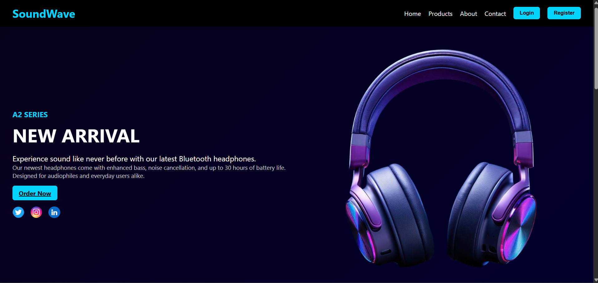

# 🎧 Responsive Headphone Landing Page Website

A bold and modern headphone landing page built using **HTML**, **CSS**, and **JavaScript**, designed for the A2 Series headphones. Fully responsive with animated UI, product highlights, login/register modals, and a contact form.

## 🚀 Features

- ✅ Responsive layout for mobile, tablet, and desktop
- 🎨 Gradient-themed hero section with animated product image
- 🛒 Product showcase with hover effects and pricing
- 📩 Contact form with email & phone info and message box
- 🔐 Login and registration modals with redirect to homepage
- 🔗 Social media icons with hover effects
- 📌 Smooth scrolling navigation with section offset fix

## 🛠️ Tech Stack

- HTML5
- CSS3
- JavaScript 

## 📸 Preview



## 📂 Project Structure

```

Responsive-Headphone-landing-page-Website/
│
├── index.html     # Main HTML file
├── style.css      # Styling and layout
├── script.js      # Form logic, navigation, animations
└── images/        # All products and icon images

```

## 🌐 Live Demo

> [Click here to view the live project](https://poorvimathur22.github.io/Responsive-Headphone-landing-page-Website/)

## 💡 How to Use

1. **Clone the Repository**  
   ```bash
   git clone https://github.com/poorvimathur22/Responsive-Headphone-landing-page-Website.git
   cd Responsive-Headphone-landing-page-Website
   ```

2. **Open `index.html` in your browser**

## 🧠 Future Enhancements

- Add real backend (Firebase/Node) for storing user data
- Convert to React + Tailwind for scalable frontend
- Add voice assistant for product queries
- Turn into a Progressive Web App (PWA)


## 🤝 Contributions

Contributions, issues, and feature requests are welcome!

## 📄 License

This project is open source and available under the [MIT License](LICENSE).
